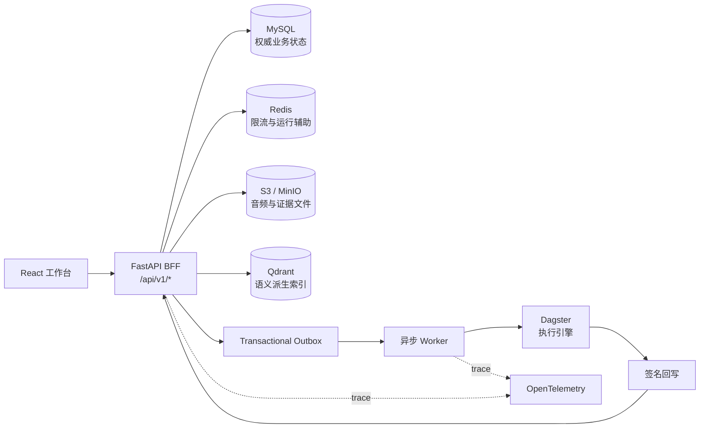

<div align="center">

# Auris Flow

### 面向音频证据的智能质检与洞察中台

从音频接入、转写调听、标签治理到评测、知识沉淀与业务洞察，<br>
用同一条可追溯链路连接数据、模型、任务与人。

<p>
  
  
  
  
  
  
</p>

<p>
  <a href="#-为什么是-auris-flow">产品定位</a> ·
  <a href="#-系统架构">系统架构</a> ·
  <a href="#-快速开始">快速开始</a> ·
  <a href="#-验证与质量门禁">质量门禁</a> ·
  <a href="#-项目状态">项目状态</a>
</p>

<sub>Enterprise audio evidence, quality evaluation and insight platform.</sub>

</div>

---

## ✨ 为什么是 Auris Flow

传统音频质检系统往往把“音频、转写、标签、评测、洞察”拆成彼此孤立的页面。Auris Flow
把它们建模为同一条证据链：每次运行、人工操作和业务结论都能追溯至对应的租户、项目、对象与
`trace_id`。

| 闭环 | 能力 |
| --- | --- |
| **数据进入** | 连接器、批次、音频资产、转写与说话人分离 |
| **证据生产** | 波形调听、片段证据、人工标注、标签版本与发布 |
| **质量评测** | 评测集、规则/模型评测、badcase、校准与复核 |
| **知识沉淀** | 知识库、证据索引、语义召回与可解释引用 |
| **业务洞察** | 指标聚合、趋势分析、洞察 Agent 与报告导出 |
| **可信运行** | 租户隔离、幂等、审计、Outbox、回写签名与全链路追踪 |

> [!IMPORTANT]
> 本仓库是 Auris Flow `v1.0.0` 的**候选实现**，可用于原型评审、后端联调和工程验证；它尚未完成正式
> Release 审批与生产支持验收。详见[项目状态](#-项目状态)。

## 🧭 产品工作台

前端原型是后端开发的真实交互基线，覆盖以下一级模块：

- **任务画布**：配置处理链路、提交运行、查看状态与失败原因。
- **数据资产**：管理音频、批次、转写结果、派生文件和血缘。
- **调听工作台**：波形、说话人、转写、片段证据与人工标签协同。
- **标签中心**：标签定义、版本、样本、发布与生命周期统计。
- **评测中心**：评测集、执行记录、指标、badcase 与校准闭环。
- **知识库**：知识条目、证据引用、向量索引和检索解释。
- **洞察中心**：业务指标、趋势、归因、报告与行动建议。
- **平台设置**：连接器、成员、角色、项目与运行环境治理。

这些模块共享同一套业务对象和状态语义。Dagster 只负责底层执行映射，不会作为产品画布或业务
API 暴露给用户。

## 🏗 系统架构



### 技术基线

| 层次 | 选型 | 职责 |
| --- | --- | --- |
| Web | React 18、TypeScript、Vite | 高保真中台原型与 BFF 联调 |
| API | FastAPI、Pydantic、SQLAlchemy、Alembic | 认证、投影、业务契约与迁移 |
| 数据 | MySQL 8.4、Redis 7.4 | 权威状态、聚合、限流与运行辅助 |
| 文件 | MinIO / S3 / OBS / OSS | 音频、转写、证据包、报告与导出 |
| 检索 | Qdrant | 知识、证据、样本和 badcase 的派生向量索引 |
| 编排 | Dagster | 后台任务执行、状态同步与签名 completion |
| 可观测性 | OpenTelemetry、Prometheus、Tempo、Grafana | Trace、Metrics、Logs 与告警基线 |

第一阶段不以 ClickHouse 为默认组件。洞察与大盘使用 MySQL 聚合/预计算、Redis 辅助和 Qdrant
召回解释。

## 🚀 快速开始

### 环境要求

- Python `3.12`（项目代码兼容 `>=3.11`）
- [`uv`](https://docs.astral.sh/uv/) `0.10.x`
- Node.js `22`
- Docker Engine / Docker Desktop

仓库已提交 Python 与 Node 锁文件，建议始终使用锁定依赖安装。

### 一键启动

```bash
git clone https://github.com/g5n-dev/auris_flow.git
cd auris_flow
bash scripts/dev_up.sh
```

脚本会检查依赖、启动 MySQL/Redis/MinIO/Qdrant、执行迁移与 seed，并以前台方式运行：

- Web：`http://127.0.0.1:5173`
- BFF：`http://127.0.0.1:8000`
- OpenAPI：`http://127.0.0.1:8000/docs`
- MinIO Console：`http://127.0.0.1:9001`

本地演示账户：

```text
邮箱：demo.operator@auris.local
密码：auris-demo
租户：aurora_auto
项目：sales_qa
```

开发登录仅在 `local/test/ci` 且 `ALLOW_DEV_AUTH=true` 时启用，不得用于生产环境。

### 分步启动

<details>
<summary><strong>1. 启动基础依赖</strong></summary>

```bash
docker compose -f docker/local/docker-compose.yml up -d
```

</details>

<details>
<summary><strong>2. 启动 BFF 与 Worker</strong></summary>

```bash
cd backend
uv sync --frozen --all-extras --python 3.12
cp .env.example .env
uv run alembic upgrade head
uv run python -m app.seed local_demo

APP_ENV=local ALLOW_DEV_AUTH=true \
  uv run uvicorn app.main:app --host 127.0.0.1 --port 8000 --reload --no-access-log
```

在另一个终端启动 Outbox Worker：

```bash
cd backend
uv run python -m app.workers.outbox_worker
```

</details>

<details>
<summary><strong>3. 启动前端</strong></summary>

```bash
cd prototype/auris-flow-ui
npm ci --ignore-scripts
npm run dev
```

</details>

## 🔐 可信工程基线

Auris Flow 的写操作从第一阶段即按企业系统约束设计：

- **隔离**：每个业务请求显式绑定租户与项目上下文。
- **认证**：生产基线采用 OIDC Authorization Code + PKCE 和不透明 HttpOnly 浏览器会话。
- **防护**：Cookie 写请求强制 CSRF Token 与可信 Origin 校验。
- **幂等**：写入入口、任务提交和外部回写具备幂等语义。
- **审计**：关键操作记录主体、作用域、对象、结果和 `trace_id`。
- **可靠异步**：数据库事务与 Outbox 协同，失败支持重试与死信治理。
- **安全回写**：外部 callback 使用 HMAC 签名、时间窗与重放防护。
- **可观测**：业务 `trace_id` 与活动 OpenTelemetry trace/span 关联。

生产环境不得使用仓库内的示例密码、开发 Token、确定性向量或本地对象存储凭据。完整说明见
[安全策略](SECURITY.md)与[安全事件响应](doc/runbooks/security-incident-response.md)。

## ✅ 验证与质量门禁

日常开发验证：

```bash
bash scripts/verify_fast.sh
```

如果本机存在多个 Python 环境：

```bash
PYTHON=/absolute/path/to/python bash scripts/verify_fast.sh
```

该门禁覆盖规格校验、Readiness、Ruff、mypy、Alembic 升降级、后端单元/契约/集成测试、BFF
Smoke、前端架构检查、生产构建、Bundle Budget 与 Playwright UI Smoke。

| 场景 | 命令 | 适用范围 |
| --- | --- | --- |
| 快速反馈 | `bash scripts/verify_fast.sh` | 复用本地依赖的日常开发门禁 |
| 干净克隆 | `bash scripts/verify_clean_clone.sh` | 锁文件与源码可复现性 |
| UI / BFF | `AURIS_RUN_E2E=1 bash scripts/verify_all.sh` | 浏览器交互与 API 联调 |
| 真实依赖栈 | `bash scripts/verify_real_stack.sh` | MySQL、Redis、MinIO、Qdrant |
| 真实 Dagster | `bash scripts/verify_real_dagster.sh` | 执行引擎、取消和回写 |
| 产品执行链路 | `bash scripts/verify_product_dagster_path.sh` | BFF → Outbox → Dagster → 状态同步 |
| 发布候选 | `bash scripts/verify_release.sh` | 严格、Fail-closed 的完整发行门禁 |

> [!NOTE]
> `verify_fast.sh` 和开发真实栈用于工程反馈，不等同于公开发行证据。严格 Release 要求所有证据
> 绑定同一个干净 commit，并通过不可变前端制品、视觉基线、供应链与人工授权检查。

## 📁 仓库结构

```text
.
├── backend/                   # FastAPI BFF、领域模型、迁移与测试
├── prototype/auris-flow-ui/  # React + TypeScript 高保真工作台
├── docker/local/             # 本地 MySQL、Redis、MinIO、Qdrant
├── production/               # 单机生产候选、Dagster 与可观测性
├── doc/backend-spec/         # API、数据模型、状态机、RBAC 与事件契约
├── doc/runbooks/             # 运维、恢复、轮换、升级与安全响应
├── scripts/                  # 验证、审计、E2E 与发布证据工具
└── plans/                    # 设计与闭环演进计划
```

## 📚 文档导航

| 主题 | 文档 |
| --- | --- |
| 产品与交互 | [产品设计](doc/设计文档.md) · [UI 设计](doc/UI设计文档.md) · [Agentic 设计](doc/Agentic智能化设计文档.md) |
| 后端契约 | [后端规格入口](doc/backend-spec/README.md) · [API 契约](doc/backend-spec/api-contract.md) · [领域模型](doc/backend-spec/domain-model.md) |
| 权限与事件 | [RBAC 矩阵](doc/backend-spec/rbac-matrix.md) · [状态机](doc/backend-spec/state-machines.md) · [事件契约](doc/backend-spec/event-contracts.md) |
| 部署与运维 | [生产候选安装](production/README.md) · [运维手册](doc/runbooks/operations.md) · [备份恢复](doc/runbooks/backup-restore.md) |
| 开源协作 | [贡献指南](CONTRIBUTING.md) · [行为准则](CODE_OF_CONDUCT.md) · [安全策略](SECURITY.md) · [支持范围](SUPPORT.md) |
| 发行治理 | [Release Checklist](RELEASE_CHECKLIST.md) · [版本策略](doc/release/versioning-and-compatibility.md) · [变更记录](CHANGELOG.md) |

## 🗺 项目状态

当前仓库定位为 **Open-source Release Candidate**：

- 已具备完整前端原型、FastAPI BFF、数据库迁移、真实 Dagster 执行基线和多层验证脚本。
- 已包含 Apache License 2.0 标准文本、候选 `NOTICE` 与第三方许可清单。
- 尚需项目所有者完成许可权利主体/版权归属授权、NOTICE 定稿和正式 Release 审批。
- 尚需完成受保护环境中的不可变视觉与前端制品批准、外部干净安装和生产演练。

因此，在这些人工与运行门禁完成前，不应把当前代码描述为“正式开源发布完成”或“已通过生产
部署验收”。进度以[开源发布清单](RELEASE_CHECKLIST.md)和
[Release Readiness](doc/reports/open-source-release-readiness.md)为准。

## 🤝 参与贡献

欢迎围绕契约补全、前后端联调、可观测性、安全、测试和文档提出改进。提交前请先阅读
[CONTRIBUTING.md](CONTRIBUTING.md)，并至少运行：

```bash
bash scripts/verify_fast.sh
```

安全问题请按 [SECURITY.md](SECURITY.md) 私下报告，不要直接创建公开 Issue。

## 📄 许可

仓库包含 [Apache License 2.0](LICENSE) 文本。当前许可权利主体和版权归属授权仍处于 Release
门禁中；在项目所有者完成签署并定稿 `NOTICE` 前，不得据此宣称正式开源发行已完成。

---

<div align="center">
  <strong>Auris Flow</strong> · 让每一条业务洞察都能回到它的音频证据。
</div>
