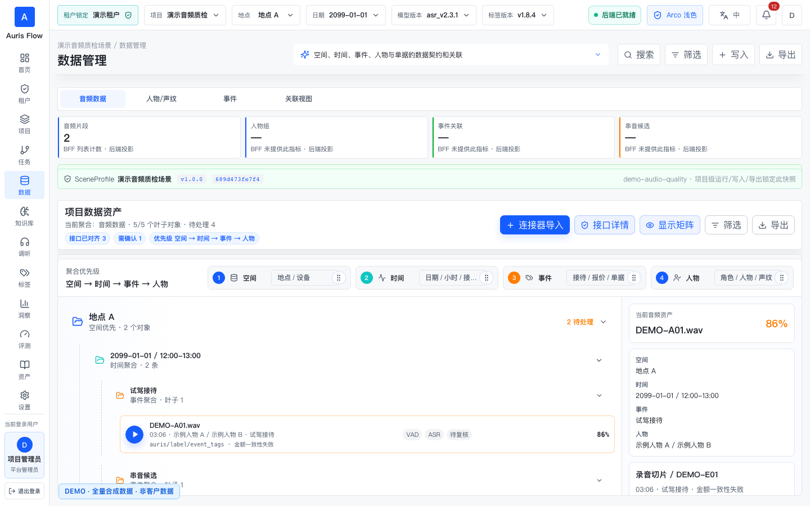
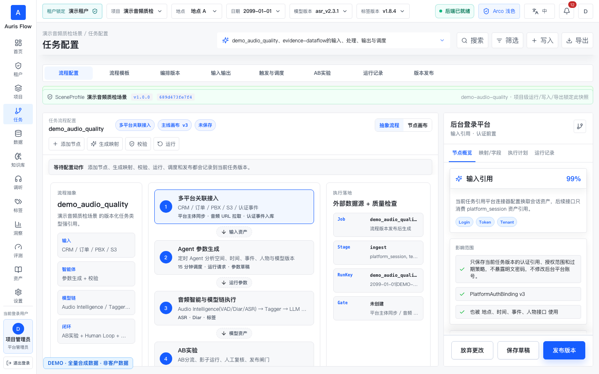
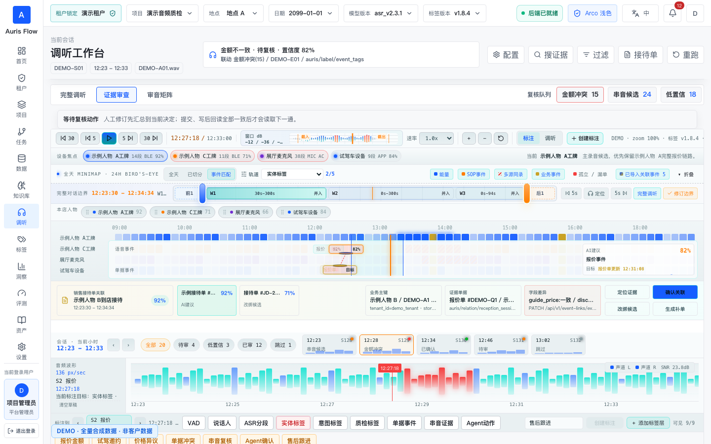

<div align="center">

# Auris Flow

### 让每一条业务洞察，都能回到它的音频证据

面向音频质检、标注、评测与洞察的可追溯工作台。<br>
一条链路以空间、时间、事件和人物为上下文，连接音频、转写、标签、模型、任务和最终业务结论。

<p>
  <a href="https://github.com/g5n-dev/auris_flow/actions/workflows/verify.yml">
    
  </a>
  <a href="https://github.com/g5n-dev/auris_flow/actions/workflows/codeql.yml">
    
  </a>
  
  
  
</p>

<p>
  
  
  
  
  
  
</p>

<p>
  <a href="#quickstart"><strong>5 分钟启动</strong></a>
  · <a href="#screenshots">操作截图</a>
  · <a href="#tour">能力导览</a>
  · <a href="#architecture">系统架构</a>
  · <a href="#quality">验证门禁</a>
  · <a href="#release-status">生产边界</a>
  · <a href="production/README.md">生产候选部署</a>
</p>

<sub>Audio evidence · quality evaluation · governed AI workflows · explainable insight</sub>

</div>

<a id="screenshots"></a>

## 操作导览：从导入到人工决定

> 以下界面按“空间 → 时间 → 事件 → 人物”组织数据；空间维度中的地点以及租户、项目、音频、单据、金额、时间和指标均为程序生成的合成演示数据，不对应任何真实客户或业务记录。

### 1. 新建音频导入配置



1. 打开 **数据资产 → 音频资产**。
2. 点击 **连接器导入**，选择已有平台连接及地点范围。
3. 填写音频 URL API、凭证引用、分页方式、首次时间窗口和字段映射。
4. 完成连通测试与三条记录预览，再保存并发布配置。

**完成标志：** 页面回读已发布任务版本，并允许执行“立即拉取”。

### 2. 发布任务版本并立即拉取



1. 在任务配置中确认地点范围、时间窗口、目标音频资产和后续处理策略。
2. 校验配置并发布不可变任务版本。
3. 点击 **立即拉取**，查看读取清单、下载音频、校验入库和生成会话阶段。
4. 完成后查看成功数、重复跳过数、失败项和新音频会话。

**完成标志：** 导入批次达到业务终态，新会话可查询、可播放。

### 3. 播放音频、核验证据并提交决定



1. 从导入结果点击 **查看新会话**，进入调听工作台。
2. 播放音频并核对时间窗、证据片段、字段差异和关联单据。
3. 修订主录音、串音、低置信、边界或标签结论。
4. 点击 **提交决定并进入下一通**，等待写后回读一致后推进队列。

**完成标志：** 决定、受影响对象、下一通任务和根 Trace 均由 BFF 回读一致。

> 截图用于说明操作路径；权威业务状态仍以 BFF 回读为准。

---

<a id="tour"></a>

## 从音频到行动，不丢失上下文

传统音频质检系统把音频、转写、标签、评测和报表拆成互不相干的页面。Auris Flow 以“空间 → 时间 → 事件 → 人物”组织业务上下文，并把它们建模为同一条证据链：每次运行、人工判断、版本变更和业务结论都绑定 `tenant_id`、`project_id` 与 `trace_id`。

- **进入系统**：连接器、批次、音频资产。冻结地点范围和时间窗口，保留对象身份与内容哈希。
- **形成证据**：事件、人物、转写、说话人、片段和人工标注。派生结果全程可追溯。
- **做出判断**：标签版本、评测集、校准、复核。规则、模型与人保持版本绑定。
- **推动行动**：洞察报告、实验、发布、回滚。结果可回到证据和执行记录。

> `tenant · project · trace_id` 贯穿整条链路，业务结果始终可以回到源音频和执行记录。

<details open>
<summary><strong>🎧 我想先体验产品工作台</strong></summary>

启动本地环境后，从任务画布进入完整演示链路：

1. 在**数据资产**查看音频、转写、派生对象和血缘。
2. 在**调听工作台**使用波形、说话人、转写和片段证据协同复核。
3. 在**标签中心**查看标签定义、样本、版本、发布和生命周期统计。
4. 在**评测中心**执行评测，追踪指标、badcase、校准与人工复核。
5. 在**知识库**查看证据引用、派生向量索引和召回解释。
6. 在**洞察中心**把指标、归因、报告和后续行动重新绑定到源证据。

</details>

<details>
<summary><strong>🔌 我想联调 API</strong></summary>

- 业务接口统一位于 `/api/v1/*`，资源使用复数与 kebab-case。
- OpenAPI：[`http://127.0.0.1:8000/docs`](http://127.0.0.1:8000/docs)
- 存活检查：[`/healthz`](http://127.0.0.1:8000/healthz)
- 强依赖就绪检查：[`/readyz`](http://127.0.0.1:8000/readyz)
- 错误响应使用稳定 envelope，并携带 request ID 与 trace ID。
- 前端只访问 BFF，不直连 MySQL、Redis、对象存储、Qdrant 或 Dagster。

完整契约从 [后端规格入口](doc/backend-spec/README.md) 开始阅读。

</details>

<details>
<summary><strong>🏭 我想评估单机生产候选</strong></summary>

生产候选由 FastAPI BFF、异步 Worker、MySQL、Redis、MinIO、Qdrant、真实 Dagster、Keycloak
参考 IdP、反向代理和可观测性组件组成。它只面向一台 64 位 Linux 主机，不宣称节点级高可用或
宿主机故障自动容灾。

不要直接复用本地示例凭据。先阅读 [生产候选安装与支持边界](production/README.md)，再按
[备份恢复](doc/runbooks/backup-restore.md)和[升级回滚](doc/runbooks/upgrade-rollback.md)完成演练。

</details>

<a id="quickstart"></a>

## 5 分钟启动本地工作台

### 需要什么

- Python `3.12`（代码兼容 `>=3.11`）
- [`uv`](https://docs.astral.sh/uv/) `0.10.x`
- Node.js `22`
- 正在运行的 Docker Engine / Docker Desktop

### 安装并启动

```bash
git clone https://github.com/g5n-dev/auris_flow.git
cd auris_flow

(cd backend && uv sync --frozen --all-extras --python 3.12)
npm ci --prefix prototype/auris-flow-ui --ignore-scripts

PYTHON="$PWD/backend/.venv/bin/python" bash scripts/dev_up.sh
```

`dev_up.sh` 会启动本地 MySQL、Redis、MinIO、Qdrant，执行迁移和演示数据初始化，再托管 BFF、
Outbox Worker 与 Vite。按 <kbd>Ctrl</kbd> + <kbd>C</kbd> 可停止应用进程；基础依赖容器仍会保留，
方便下次快速启动。

| 入口 | 地址 |
| --- | --- |
| 工作台 | [`http://127.0.0.1:5173`](http://127.0.0.1:5173) |
| BFF | [`http://127.0.0.1:8000`](http://127.0.0.1:8000) |
| OpenAPI | [`http://127.0.0.1:8000/docs`](http://127.0.0.1:8000/docs) |
| Readiness | [`http://127.0.0.1:8000/readyz`](http://127.0.0.1:8000/readyz) |
| MinIO Console | [`http://127.0.0.1:9001`](http://127.0.0.1:9001) |

本地演示登录：

```text
邮箱    demo.operator@auris.local
密码    auris-demo
租户    aurora_auto
项目    sales_qa
```

> [!CAUTION]
> 这个账户和 `ALLOW_DEV_AUTH=true` 只允许出现在 `local/test/ci`。生产配置发现 demo credential、
> 弱签名密钥、通配 CORS、开发认证或 fake adapter 时会 fail closed。

<details>
<summary><strong>手动分三步启动</strong></summary>

**1. 基础依赖**

```bash
docker compose -f docker/local/docker-compose.yml up -d
```

**2. BFF 与 Worker**

```bash
cd backend
uv sync --frozen --all-extras --python 3.12
uv run alembic upgrade head
uv run python -m app.seed local_demo

APP_ENV=local ALLOW_DEV_AUTH=true \
  uv run uvicorn app.main:app --host 127.0.0.1 --port 8000 --reload --no-access-log
```

在另一个终端：

```bash
cd backend
APP_ENV=local ALLOW_DEV_AUTH=true uv run python -m app.workers.outbox_worker
```

**3. 前端**

```bash
cd prototype/auris-flow-ui
npm ci --ignore-scripts
npm run dev
```

</details>

<a id="architecture"></a>

## 系统架构

<a href="doc/architecture/README.md">
  <picture>
    <source media="(prefers-color-scheme: dark)" srcset="doc/assets/architecture-dark.svg">
    
  </picture>
</a>

<p align="center">
  <sub>蓝色：产品体验　·　青色：领域控制　·　琥珀：权威数据　·　紫色：可重建能力</sub><br>
  <a href="doc/architecture/README.md"><strong>打开完整架构说明与关键链路</strong></a>
</p>

### 不可跨越的边界

| 边界 | 约束 |
| --- | --- |
| 权威数据 | MySQL 是权威业务存储；对象存储保存权威对象。Redis 与 Qdrant 不能成为唯一业务事实来源。 |
| 执行引擎 | Dagster 只承担后台执行，不作为业务 API 语言，也不在产品界面暴露为“Dagster 画布”。 |
| 前端访问 | 浏览器只访问 Edge/BFF，不持有长期 bearer token，不直连基础设施。 |
| 洞察路径 | 第一阶段使用 MySQL 聚合/预计算、Redis 辅助和 Qdrant 召回解释，不引入 ClickHouse。 |
| 部署边界 | 首发目标是 Linux 单机 Docker Compose；不承诺自动故障转移或节点级高可用。 |

### 技术基线

| 层 | 组件 | 主要职责 |
| --- | --- | --- |
| Web | React 18、TypeScript、Vite | 模块化工作台、可见交互反馈、BFF 联调 |
| API | FastAPI、Pydantic、SQLAlchemy、Alembic | 认证、业务契约、强表、迁移 |
| Data | MySQL 8.4、Redis 7.4 | 权威状态、审计、Outbox、限流与运行辅助 |
| Object | MinIO / S3 / OBS / OSS | 音频、转写、证据包、报告与导出 |
| Recall | Qdrant | 知识、证据、样本和 badcase 的派生语义索引 |
| Execution | Dagster | 提交、状态同步、取消、超时、重试与恢复 |
| Observability | OpenTelemetry、Prometheus、Tempo、Grafana | Trace、Metrics、Dashboard 与告警 |

<details>
<summary><strong>音频为什么可以拖动播放：HTTP Range 链路</strong></summary>

浏览器原生媒体元素可以直接使用短期 playback grant 请求
`GET /api/v1/audio-playback?grant=…`，无需把长期 Authorization header 暴露给媒体组件。

| 顺序 | 发起方 → 接收方 | 请求 / 响应 |
| --- | --- | --- |
| 1 | Browser → BFF | 申请短期 playback grant |
| 2 | BFF → Browser | 返回 `/api/v1/audio-playback?grant=…` |
| 3 | Browser → BFF | `GET` + `Range: bytes=…` |
| 4 | BFF → Object Storage | Provider-signed ranged GET |
| 5 | Object Storage → BFF | `206` + `Content-Range` |
| 6 | BFF → Browser | `206` + `Accept-Ranges` + `ETag` |

- 支持 `GET` / `HEAD`、闭区间、开放区间、suffix range 和 `If-Range`。
- 合法部分请求返回 `206`；不可满足或多区间请求稳定返回 `416`。
- MinIO、S3、华为云 OBS 与阿里云 OSS 的 provider 签名不会交叉复用配置。
- Edge 对该精确 playback location 关闭 access log，避免 query 中的短期 grant 落盘；上游 WAF、
  LB 与 APM 也必须遵守同一约束。

</details>

<a id="trust"></a>

## 可信运行基线

写操作从一开始就按多租户生产系统约束建模：

- **身份**：OIDC Authorization Code + PKCE；浏览器只持有 Secure Cookie 中的不透明 HttpOnly 浏览器会话。
- **授权**：资源级 default-deny，租户、项目、角色与对象范围同时校验。
- **浏览器防护**：Cookie 写请求校验 CSRF token 与可信 Origin。
- **幂等与审计**：写入口、任务提交和回写都记录主体、作用域、结果、request ID 与 `trace_id`。
- **可靠异步**：事务 Outbox、租约、fencing、退避、死信与人工重放形成闭环。
- **安全回写**：HMAC key id、时间窗、nonce、幂等键、重放防护和轮换窗口。
- **Secret**：生产值只允许通过 Docker secret 或外部 secret file/reference 注入。
- **可观测性**：业务 `trace_id` 与 OTel trace/span 关联，日志执行字段级脱敏。

安全问题请按 [SECURITY.md](SECURITY.md) 私下报告，不要创建公开 Issue。运维处置见
[安全事件响应 Runbook](doc/runbooks/security-incident-response.md)。

<a id="quality"></a>

## 验证与质量门禁

日常开发使用同一个入口：

```bash
PYTHON="$PWD/backend/.venv/bin/python" bash scripts/verify_fast.sh
```

它覆盖规格与 OpenAPI、secret scan、Ruff、mypy、Alembic 升降级、后端单元/契约/集成测试、
前端架构与构建、bundle budget 和 UI smoke。

| 要证明什么 | 命令 |
| --- | --- |
| 日常工程反馈 | `bash scripts/verify_fast.sh` |
| 干净克隆可复现 | `bash scripts/verify_clean_clone.sh` |
| 浏览器与 BFF 闭环 | `AURIS_RUN_E2E=1 bash scripts/verify_all.sh` |
| MySQL / Redis / MinIO / Qdrant | `bash scripts/verify_real_stack.sh` |
| 真实 Dagster 引擎 | `bash scripts/verify_real_dagster.sh` |
| BFF → Outbox → Dagster → 回写 | `bash scripts/verify_product_dagster_path.sh` |
| 镜像前发行门禁 | `bash scripts/verify_release.sh --pre-image` |
| 签名发行证据聚合 | 使用最终 tag workflow 产出的 recovery JSON、Sigstore sidecar 与同一签名 deployment，设置 `AURIS_BACKUP_RESTORE_EVIDENCE`、`AURIS_BACKUP_RESTORE_EVIDENCE_SIGSTORE_BUNDLE`、`AURIS_RELEASE_BUNDLE_ROOT`、`AURIS_RELEASE_TAG` 后运行 `bash scripts/verify_release.sh`；仍须满足 `RELEASE_CHECKLIST.md` 中独立的 `rebuild-required`、外部无标签 staging 安装与私有发行审批 |

<details>
<summary><strong>为什么本地全绿仍不能直接发布</strong></summary>

公开 Release 证据必须全部绑定同一个干净 commit，并同时满足：

- 不可变且独立审批的前端 bundle 与 Linux 视觉基线；
- 真实依赖 E2E、备份恢复演练与告警演练；
- 固定镜像 digest、SBOM、漏洞扫描、签名与 checksum；
- 第三方依赖许可结论与完整发行物清单；
- 外部维护者在干净主机上的安装、升级、回滚与恢复验证。

因此发布门禁严格绑定真实制品和外部证据，不能由本地状态字段代替。

</details>

<a id="repository"></a>

## 仓库地图

```text
.
├── backend/                   # FastAPI BFF、领域服务、迁移与测试
├── prototype/auris-flow-ui/  # React + TypeScript 产品工作台
├── docker/local/             # 本地 MySQL、Redis、MinIO、Qdrant
├── production/               # 单机生产候选、Dagster、Edge、可观测性
├── doc/backend-spec/         # API、模型、RBAC、状态机与事件契约
├── doc/runbooks/             # 安装、升级、恢复、轮换与事件响应
├── scripts/                  # 验证、审计、E2E 与发行证据工具
└── plans/                    # 设计决策与闭环演进计划
```

| 我在找…… | 从这里开始 |
| --- | --- |
| 产品与交互 | [产品设计](doc/设计文档.md) · [UI 设计](doc/UI设计文档.md) · [Agentic 设计](doc/Agentic智能化设计文档.md) |
| API 与领域模型 | [后端规格](doc/backend-spec/README.md) · [API 契约](doc/backend-spec/api-contract.md) · [领域模型](doc/backend-spec/domain-model.md) |
| 权限与异步事件 | [RBAC 矩阵](doc/backend-spec/rbac-matrix.md) · [状态机](doc/backend-spec/state-machines.md) · [事件契约](doc/backend-spec/event-contracts.md) |
| 部署与运维 | [生产候选](production/README.md) · [运维手册](doc/runbooks/operations.md) · [备份恢复](doc/runbooks/backup-restore.md) |
| 参与协作 | [贡献指南](CONTRIBUTING.md) · [行为准则](CODE_OF_CONDUCT.md) · [支持范围](SUPPORT.md) |
| 发行治理 | [Release Checklist](RELEASE_CHECKLIST.md) · [版本策略](doc/release/versioning-and-compatibility.md) · [CHANGELOG](CHANGELOG.md) |

<a id="release-status"></a>

## 生产边界

当前仓库是 `v1.0.0` 的候选实现，面向产品评审、联调和工程验证。首个生产支持目标是 Linux
单机 Docker Compose；不承诺节点级高可用或宿主机故障自动容灾。

正式版本只从同一受保护提交生成源码、固定镜像 digest、SBOM、签名、迁移说明和校验和，并在外部
干净环境完成安装、升级、回滚及恢复演练。当前进度以
[Release Checklist](RELEASE_CHECKLIST.md) 为准。

## 参与贡献

欢迎围绕契约、前后端联调、可观测性、安全、测试和文档提出改进。开始前请阅读
[CONTRIBUTING.md](CONTRIBUTING.md)，提交前至少运行：

```bash
PYTHON="$PWD/backend/.venv/bin/python" bash scripts/verify_fast.sh
```

<details>
<summary><strong>English overview</strong></summary>

Auris Flow is an evidence-first workspace for audio quality operations. It connects audio assets,
transcripts, human review, label versions, evaluations, knowledge retrieval and business insights
through tenant-, project- and trace-scoped workflows.

The repository currently represents a `v1.0.0` release candidate. Its target production baseline is
a single Linux host running Docker Compose with FastAPI, MySQL, Redis, object storage, Qdrant,
Dagster, a standards-compatible OIDC provider and an observable edge. It does **not** claim
node-level high availability or a completed public release.

Start with [the local quickstart](#quickstart), [the API specification](doc/backend-spec/README.md),
or [the production candidate guide](production/README.md).

</details>

## License

- 项目许可：[Apache License 2.0](LICENSE)
- 第三方许可：[许可清单](THIRD_PARTY_NOTICES.md)

---

<div align="center">
  <strong>Auris Flow</strong><br>
  <sub>Evidence in. Decisions out. Traceability throughout.</sub>
</div>
