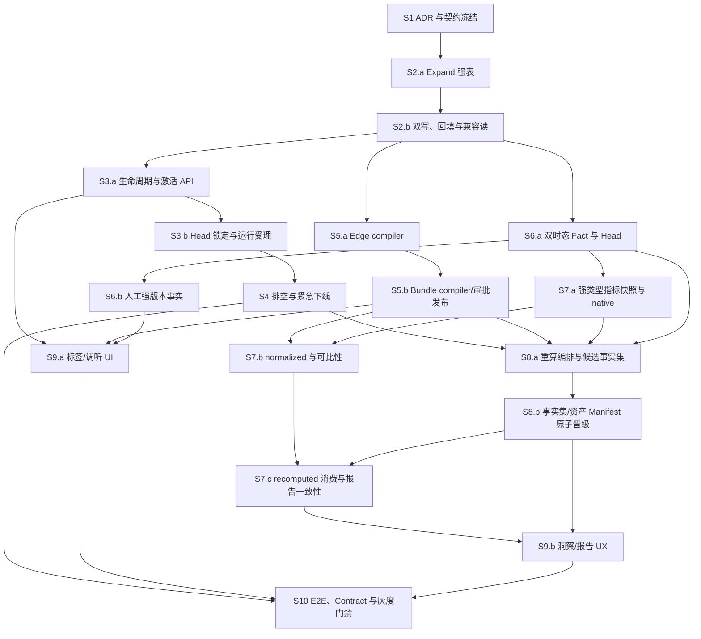

# Auris Flow 标签生命周期与统计闭环建设蓝图

> 状态：执行中；S2.b 兼容回填/双写已完成，下一步并行推进 S3.a/S5.a/S6.a
> 制定日期：2026-07-18
> 基线分支：`codex/open-source-harness-baseline`
> 建立时执行模式：Direct mode（当时仓库未配置 Git remote，且工作区存在大量未提交改动；该记录用于解释工作包边界，不代表当前发布树状态）

## 1. 工程目标

在 Auris Flow 中建立可验证的标签生命周期与统计分析完整闭环：

- 所有自动打标、人工打标、聚合事实、指标快照和报告都强绑定不可变 `label_version_id`。
- 支持 LabelVersion 的生效、替代、废弃、归档，以及版本内标签的保留、改名、一对一替代、合并、拆分和无替代退出。
- 标签废弃不删除、不改写历史事实；事实修正与标签废弃使用不同状态语义。
- 洞察统一支持原生口径 `native`、统一口径 `normalized`、固定版本重算 `recomputed`。
- 任何同比、环比和跨版本趋势都能说明是否可比，并可回溯版本、映射、事实截止点、指标定义、运行、证据和 Trace。
- 所有写操作满足租户/项目隔离、RBAC、幂等、审计、Trace、Outbox、失败重试和回滚要求。

## 2. 非目标与边界

- 不删除既有 mock data、组件或状态逻辑；前端采用局部增强，不重写 `App.tsx`、主导航、顶部栏或页面层级。
- 不把 Qdrant、Redis 或前端本地状态当作标签事实权威源；MySQL 强表仍是权威源。
- 不引入 ClickHouse。第一阶段继续使用 MySQL 聚合/预计算、Redis 缓存和 Dagster 执行映射。
- 不在 UI 暴露“Dagster 画布”或让 Dagster 成为业务 API 语言。
- 不对拆分标签做比例分摊，不为了趋势连续而制造不可验证的历史数字。
- 不修改已经存在的 Alembic revision；只追加新的 forward migration。

## 3. 当前基线与已确认缺口

当前已有可复用底座：

- `LabelNode.label_id` 是稳定标签身份，`LabelVersionItem` 是版本内定义快照。
- `LabelObservation`、`LabelAggregate`、`LabelFact` 都保存 `label_version_id`。
- Observation 具备数据库级 append-only 保护；Aggregate/Fact 保留策略、证据与 Trace 血缘。
- `MetricResult` 已按物化快照使用并可冻结部分标签范围，但尚缺数据库级 append-only、强类型口径字段和内容 hash 约束。
- `ReleaseBundleHead` 已保存生产环境当前生效的 `label_version_id`，不得再创建互相竞争的“当前标签版本”指针。

当前缺口：

- LabelVersion 强表尚缺 `taxonomy_id`、语义版本、生效/失效时间、替代关系和废弃原因等强字段。
- 没有 LabelVersion/LabelVersionItem 的正式废弃 API，也没有可供统计消费的不可变跨版本映射。
- 发布新标签版本不会原子收敛旧版本生命周期。
- 在途生产抽取完成时仍要求版本为 `published`；直接废弃会让已受理回执失败。
- `LabelFact` 当前通过更新旧行完成 `active → superseded`，且 active head 跨版本唯一；只查 active 会造成历史数字漂移。
- Fact 缺业务发生时间；不能安全地用打标落库时间代替业务分桶时间。
- 普通人工调听标注仍以自由文本/JSON 投影为主，未强制 `label_id + label_version_id`。
- 洞察 `label_version` 可空，前端原型的版本按钮未真正过滤本地指标，可能出现页面混版本、报告单版本。

## 4. 统一领域语义

### 4.1 三类状态必须分离

| 对象 | 状态语义 | 禁止混用 |
| --- | --- | --- |
| LabelVersion 制品 | `draft → candidate → validated → locked → evaluating → review/gate → approved → published → deprecated → archived`，不携带某环境的 active/draining/rollback | legacy gray/rollback 状态只读迁入 activation ledger；制品废弃不能改历史 Fact |
| ReleaseDeployment / Head 激活历史 | 每个环境独立 `active → draining → inactive/rolled-back` | 生产是否受理运行由环境 Head 决定，不只看 LabelVersion.status |
| LabelVersionItem | 版本内仅表达 `active/retired/pending-configuration` 等快照状态 | `rename/replace/merge/split` 属于跨版本 mapping relation，不写回已发布版本项 |
| LabelFact | 新事实通过 `supersedes_fact_id` 替代旧事实 | Fact superseded 只表示事实修正，不表示标签退出 |

### 4.2 三种统计口径

| 口径 | 定义 | 用途 |
| --- | --- | --- |
| `native` | 按事实产生时的 `label_version_id + label_id` 统计；跨版本分区展示 | 审计、历史报表、模型质量 |
| `normalized` | 使用已发布的 mapping edge，并冻结其编译闭包 `mapping_bundle`，把一个或多个源版本映射到同一目标版本 | 经营趋势、同比、环比 |
| `recomputed` | 从原始证据按目标版本重新抽取、聚合或人工复核 | 拆分、定义实质变化、正式回填 |

### 4.3 映射规则

- 改名：优先保持稳定 `label_id`，只改变后继版本的展示定义。
- 一对一替代：`1:1` 只描述基数，不天然表示语义等价。只有 compatibility 经人工审批，且 semantic hash/评测证明可比时才能标记 exact；否则必须 structural-break 或重算。
- 改名可比性：只有除展示名称/别名外的类型、层级、聚合规则、适用范围和证据语义 hash 均未变化时才可自动连续。
- 多对一合并：禁止按主体固定去重或直接相加。指标目录必须声明统计 grain 和 lineage key，按 `metric grain + event/fact lineage + time bucket + target_label_id` 去重；默认只对 presence/distinct-count 指标可自动归一，数值、枚举和时长等指标必须有经审批的 reducer，否则为结构性断点。
- 一对多拆分：必须标记 `requires-recompute`；旧事实不能按固定比例分摊。
- 无替代退出：原生历史继续按当时版本统计；normalized 返回 `unmapped/coverage-gap` 并形成 structural-break。只有查询该标签在其适用期之外时才返回 N/A，晚到事实按 `occurred_at` 判断，不按入库时间判断。
- 多跳映射：normalized 必须冻结不可变 `mapping_bundle`，其中包含全部源版本、目标版本、选中的 mapping edges、路径、compiler version 和 canonical SHA；路径遇到 split/retire 必须中断，不得自动绕行。

### 4.4 可比性不变量

只有以下字段一致时，同比/环比才能返回 `comparable`：

- `target_label_version_id`
- `mapping_bundle_id` 及其冻结的 `mapping_version_ids[]`
- `metric_definition_version`
- `fact_as_of` 规则
- 时区、周期边界与分母定义

否则返回 `partial` 或 `structural-break`，前端不得渲染普通涨跌箭头。

### 4.5 最小 API/错误契约

| 资源 | 最小接口 | 必须冻结/校验 | 关键失败码 |
| --- | --- | --- | --- |
| 制品生命周期 | `POST /api/v1/label-versions/{id}/deprecation-preflights`、`POST /api/v1/label-versions/{id}/transitions` | expected resource version、replacement、mapping bundle、自然人审批 | `LABEL_VERSION_ACTIVE_ENVIRONMENT_REFERENCE`、`RESOURCE_VERSION_CONFLICT`、`APPROVAL_REQUIRED` |
| 环境激活 | 扩展既有 `POST /api/v1/release-deployments/{deployment_id}/transitions` | environment、expected Head generation、effective/deadline、drain policy | `RELEASE_HEAD_CAS_CONFLICT`、`LABEL_VERSION_RUNS_DRAINING` |
| Mapping Edge/Bundle | `/api/v1/label-mapping-versions`、`/api/v1/label-mapping-bundles` | scope、source set、target、resource versions、compiler/SHA、approval | `LABEL_MAPPING_COVERAGE_GAP`、`LABEL_MAPPING_AMBIGUOUS`、`LABEL_MAPPING_RECOMPUTE_REQUIRED` |
| 人工标注 | `POST /api/v1/audio-sessions/{session_id}/annotations/{annotation_id}/submissions`、对应 `/rebases` | draft version、current Head、stable label、event/evidence、occurred_at | `STALE_LABEL_VERSION`、`UNKNOWN_LABEL` |
| 指标 | 既有 `POST /api/v1/insights/metric-runs`、`GET /api/v1/insights/metrics` | taxonomy mode、source/target versions、bundle、FactSet generation、fact cutoff | `INSIGHT_LABEL_VERSION_REQUIRED`、`INSIGHT_MAPPING_BUNDLE_REQUIRED`、`INSIGHT_SOURCE_HEAD_CHANGED` |
| 重算/晋级 | `/api/v1/label-recomputation-runs`、`POST /api/v1/label-recomputation-runs/{id}/promotions` | candidate manifest SHA、expected FactSet/Asset Head generations、approval | `FACT_SET_INCOMPLETE`、`MANIFEST_HASH_MISMATCH`、`RELEASE_HEAD_CAS_CONFLICT` |

所有写接口必须携带 `Idempotency-Key`，返回 `resource_version`、`trace_id`、`audit_id`；冲突响应返回机器可读 `code`、当前 generation/resource version 和可执行 `next_actions`。示例：

```json
{
  "action": "deprecate",
  "expected_resource_version": 7,
  "replacement_label_version_id": "lv_v2",
  "mapping_bundle_id": "lmb_v1_to_v2",
  "reason": "业务定义升级"
}
```

```json
{
  "taxonomy_mode": "normalized",
  "source_label_version_ids": ["lv_v1", "lv_v2"],
  "target_label_version_id": "lv_v3",
  "mapping_bundle_id": "lmb_to_v3_20260718",
  "fact_set_generation": 42,
  "fact_as_of": "2026-07-18T10:00:00Z",
  "metric_definition_version": "sales-tags@3"
}
```

## 5. 全局完成标准

| # | 可验收结果 | 自动化证据 |
| --- | --- | --- |
| 1 | 指标目录声明为 `source_kind=label-fact|label-observation` 的请求中，未声明 taxonomy mode、版本/Bundle 和 fact cutoff 的接受数为 0；非标签指标显式声明 `label_version_applicability=none` | 契约测试 + `unscoped_label_metric_request_total{result="accepted"}=0` |
| 2 | mapping manifest 中每个源版本退出标签都有唯一 disposition；split 均为 `requires-recompute`；多跳闭包无环、无歧义 | compiler 单测 + mapping coverage 查询 |
| 3 | 标签废弃、人工修正和后续重跑均不改变已经物化的历史 Report/MetricResult 内容与 hash；同历史区间的新重跑以新的 `fact_as_of` 生成新快照，不冒充旧报告 | immutable snapshot 回归 + hash 对比测试 |
| 4 | 人工与自动权威事实均可追溯到 scope、稳定 label/version、source kind、source id、Trace 和 evidence | Fact lineage 契约测试 + orphan FK 查询为 0 |
| 5 | 任一标签指标可反查 mapping bundle、fact cutoff、metric definition、source manifest/run、结果 hash 和证据资产 | 指标详情契约 + manifest hash 重算测试 |
| 6 | create run、deployment ACK、deprecate、completion receipt 并发时不存在旧版本继续受理窗口，也不存在无解释终态 | 三方并发集成测试，重复运行至少 100 轮 |
| 7 | rename、replace、merge、split、retire、晚到事实、零分母和跨版本同比场景均有 E2E 覆盖 | E2E 场景矩阵 |
| 8 | `bash scripts/verify_all.sh` 通过；真实栈覆盖 MySQL、Redis、对象存储、Qdrant 和 Dagster 协议链路 | CI/real-stack 产物与审计报告 |

## 6. 依赖图、PR 切片与并行策略



- 串行关键路径：`S1 → S2.a → S2.b → S3.a → S3.b → S4 → S8.a → S8.b → S7.c → S9.b → S10`。
- 每个带后缀的步骤都是一个独立 PR/独立 diff 边界；下面的 S2、S3、S5、S6、S7、S8、S9 标题只是 Epic，不允许合成一个超大 PR。
- `S2.b` 完成后，`S3.a`、`S5.a`、`S6.a` 可由三个 Agent 并行；`backend/app/models.py`、migration 编号和共享枚举先由 S2 owner 冻结。
- `S9.a/S9.b` 可并行，但 `prototype/auris-flow-ui/src/api/client.ts` 由 S9.a owner 维护公共类型，S9.b 仅消费。
- 建立计划时为 Direct mode。若后续配置 remote 并清理工作区，每个步骤使用 `codex/label-lifecycle-sN-*` 分支和独立 PR；否则每步保持独立 diff 边界，不自动暂存或提交。

| 独立步骤 | 直接依赖 | 单一交付物/退出点 |
| --- | --- | --- |
| S2.a | S1 | 仅 nullable 新列、新表、索引、FK、CHECK；旧服务仍可启动 |
| S2.b | S2.a | 可重入 backfill、双写/兼容读、影子核对；不做 contract 删除 |
| S3.a | S2.b | 制品生命周期与环境 activation API/ledger 原子一致 |
| S3.b | S3.a | 运行创建事务锁定 Head generation；旧 Head 不再受理 |
| S5.a | S2.b | 单 source→target mapping edge 确定性编译且不可变 |
| S5.b | S5.a | 多跳 mapping bundle 闭包确定性编译、审批、发布 |
| S6.a | S2.b | Fact append-only、双时态、逻辑 key/head/as-of 可验证 |
| S6.b | S6.a、S3.b | 人工 draft 强版本提交与 source lineage 完整 |
| S7.a | S6.a | 标签指标强 scope、MetricResult DB 不可变、native 可用 |
| S7.b | S5.b、S7.a | normalized、grain reducer 和可比性 fail-closed |
| S8.a | S4、S5.b、S6.a、S7.a | 重算候选事实集/资产可重试生成，不影响生产读 |
| S8.b | S8.a | 单 Head 事务切换整个 FactSet/Asset Manifest，可回滚 |
| S7.c | S7.b、S8.b | recomputed 消费与看板/报告 metric IDs 完全一致 |
| S9.a | S3.a、S3.b、S5.b、S6.b | 标签治理与调听人工打标真实接入 |
| S9.b | S7.c、S8.b | 洞察三口径、断点和报告复用 UX |
| S10 | S4、S9.a、S9.b | contract migration、真实栈 E2E、灰度与回滚证据 |

## 7. 工作包

### S1：口径 ADR、状态机与 API 契约冻结

**依赖**：无
**建议模型**：最强推理模型
**目标**：先固定语义，避免数据库、Worker 和前端各自发明口径。

**上下文简报**

- 现有状态机定义了整个 LabelVersion 的 `deprecated/archived`，但没有单标签退出状态机。
- 现有洞察只接受可空 `label_version`，没有 `taxonomy_mode` 和可比性字段。
- 本步骤只冻结契约和失败语义，不迁移生产数据。

**任务**

1. 新增 ADR，明确三类生命周期状态、三种统计口径、映射规则、N/A/0、跨版本比较和事实截止语义。
2. 更新 `domain-model.md`、`state-machines.md`、`api-contract.md`、`event-contracts.md`、`db-schema.md`、`test-plan.md`。
3. 在 OpenAPI 中加入：
   - `taxonomy_mode = native|normalized|recomputed`
   - `mapping_relation = identity|rename|replace|merge|retire|split-recompute`
   - `comparability_status = comparable|partial|structural-break|not-applicable`
4. 规定标签派生指标必须显式带版本；非标签指标可通过指标目录声明 `label_version_applicability=none`。
5. 增加契约 validator，禁止文档、OpenAPI 和运行时枚举漂移。

**主要文件**

- `doc/backend-spec/label-lifecycle-statistics.md`（新增）
- `doc/backend-spec/{domain-model,state-machines,api-contract,event-contracts,db-schema,test-plan}.md`
- `doc/backend-spec/openapi-v0.1.yaml`
- `doc/backend-spec/validate_backend_spec.py`

**验证**

```bash
"${AURIS_PYTHON}" doc/backend-spec/validate_backend_spec.py
git diff --check -- doc/backend-spec
```

**退出标准**

- rename/replace/merge/split/retire 各有请求、结果和失败示例。
- 文档明确禁止无声明的跨版本混算、拆分伪分摊和废弃改写历史。
- OpenAPI 与状态机枚举一致。

**回滚**：仅回退新增契约；不得在下游步骤合入后单独回退语义。

### S2：生命周期强字段、Mapping Edge/Bundle 强表 Expand

**依赖**：S1
**建议模型**：最强推理模型
**目标**：用新 forward migration 把设计语义落到可约束的 MySQL/SQLite 模型。

**上下文简报**

- S2.a 前 Alembic head 为 `0033_task_version_release_heads`；当前工作区 head 为 `0034_label_lifecycle_mapping_expand`，不得改写 0026–0033。
- `LabelVersion` 的关键生命周期字段仍在 payload；`LabelVersionItem` 缺内容 hash/强状态约束。
- `ReleaseBundleHead` 已是生产 Bundle 唯一指针，应复用。

**任务**

1. S2.a 新增 `0034_label_lifecycle_mapping_expand.py`，仅做 expand：
   - 给 LabelVersion 增加 nullable 制品强字段：taxonomy、semantic version、base version、artifact published/deprecated 时间、废弃原因、替代版本；环境有效期不得塞进全局制品状态。
   - 给 LabelVersionItem 增加 definition hash 和必要状态约束；跨版本 disposition/compatibility 不写入已经发布的版本项。
   - 新增 `label_taxonomies` 强表，以及不可变 edge 制品 `label_mapping_versions`、`label_mapping_items`、`label_mapping_item_targets`：每个 mapping version 只锁定一对 `source_label_version_id → target_label_version_id`；item 保存每源唯一 disposition，target 子表以复合 FK 表达 retire 的零目标、普通映射的一目标和 split 的多目标。
   - 新增不可变闭包制品 `label_mapping_bundles`、`label_mapping_bundle_sources`、`label_mapping_bundle_members`、`label_mapping_bundle_paths`：bundle 锁定目标版本、强 FK 完整源版本集合、选中的 edge versions/顺序/SHA、编译路径、compiler version、canonical manifest SHA、审批和 Trace。normalized 只接受已发布 bundle ID，不接受客户端临时拼接 edges。
   - 增加不可变 `release_bundle_head_events`（或等价 activation ledger），记录 environment、generation、old/new deployment/label version、effective interval、command、Trace 和 SHA；`ReleaseBundleHead` 只保留当前投影。
   - 增加 scope 唯一键、复合 FK、状态 CHECK、查询索引和 append-only 保护。
2. S2.b 编写可暂停、可重入的 backfill/双写兼容层，从 payload 确定性回填；无法判断的行记录为 `migration-required`，不得猜测。
3. S2.b 更新 SQLAlchemy model、兼容 reader 和 migration verifier，影子比对 payload 与强字段；本阶段不删除旧字段、不收紧为 NOT NULL。
4. downgrade 仅用于从未写入新制品的本地环境；生产只允许停写、切回兼容读并以 forward migration 补偿。

**主要文件**

- `backend/migrations/versions/0034_label_lifecycle_mapping_expand.py`
- `backend/app/models.py`
- `backend/scripts/verify_migrations.py`
- `backend/tests/integration/test_label_lifecycle_migration.py`

**验证**

```bash
"${AURIS_PYTHON}" backend/scripts/verify_migrations.py
"${AURIS_PYTHON}" -m pytest backend/tests/integration/test_label_lifecycle_migration.py --no-cov
"${AURIS_PYTHON}" -m ruff check backend
"${AURIS_PYTHON}" -m mypy backend
```

**退出标准**

- 空库可升级；旧 fixture 可升级；回填可重入且有进度记录。
- 跨租户/跨项目映射 FK 失败。
- 已发布 edge/bundle/path 内容不可更新/删除；同输入、同 compiler 产生同 SHA。
- 旧服务在 expand 阶段仍可读。

**回滚**：暂停新写与 backfill；保留历史列/表，使用后续 forward migration 修正，不删除已写 mapping。

### S3：LabelVersion 生命周期 API 与生产指针收敛

**依赖**：S3.a 依赖 S2.b；S3.b 依赖 S3.a
**可并行**：S3.a 与 S5.a、S6.a 并行
**建议模型**：最强推理模型
**目标**：实现受控、幂等、可审计的废弃/归档流程，并让生产有效版本只有一个权威来源。

**上下文简报**

- 当前 `/label-versions` 有创建、PATCH、评测锁和发布，没有 deprecate/archive 动作。
- `ReleaseBundleHead.label_version_id` 已表示每环境生效版本。
- 发布旧路径不能再独立制造第二个“当前版本”。

**任务（S3.a 生命周期/激活；S3.b 运行受理）**

1. S3.a 新增资源化 transition/deprecation API：制品 transition 只包含 action、expected_resource_version、replacement、`mapping_bundle_id`、reason；环境 activation/drain transition 另带 environment、expected Head generation、effective_at/deadline 和 drain policy。replacement 时 bundle 必须覆盖被替代版本并以 replacement 为目标。
2. 环境切换与制品废弃分离：replacement 通过 ReleaseDeployment/ReleaseCommand ACK 成为目标环境 Head 后，该环境旧 activation 进入 draining/inactive；只有旧 LabelVersion 已不被任何需保护环境的 active/draining Head 引用时，制品才可 deprecated。无替代停用必须走高风险审批/safe-stop。
3. 同事务写 LabelVersion、JsonResource projection、Audit、Outbox 和资源版本 CAS。
4. 校验 replacement 同 tenant/project/taxonomy，已发布且不是自身；禁止循环替代。
5. published/deprecated/archived 版本和版本项只读；标签退出必须通过新候选版本表达。
6. S3.b 生产 extraction run 受理必须在同一数据库事务对 `ReleaseBundleHead` 加 `SELECT ... FOR UPDATE`，重验 environment、generation、active_deployment_id、active_bundle_id/bundle SHA、label_version_id 和 deployment ACK；随后在该事务内写入冻结 manifest 与 RunRecord。请求版本不是锁内 Head 时拒绝，不能只检查 `LabelVersion.status=published`。
7. 列表/详情分别返回 artifact lifecycle 与各 environment activation timeline、replacement、mapping、影响运行和 next actions。
8. 补 RBAC：系统/Agent 不得代替自然人批准废弃生产版本。

**主要文件**

- `backend/app/api/routers/labels.py`
- `backend/app/schemas/label_lifecycle.py`（新增）
- `backend/app/services/label_lifecycle_service.py`（新增）
- `backend/app/services/{audit_service,outbox_service,read_policy_service}.py`
- `backend/tests/contract/test_label_lifecycle_api.py`

**验证**

```bash
"${AURIS_PYTHON}" -m pytest backend/tests/contract/test_label_lifecycle_api.py --no-cov
"${AURIS_PYTHON}" -m pytest backend/tests/integration/test_label_release_delivery.py --no-cov
"${AURIS_PYTHON}" -m ruff check backend
"${AURIS_PYTHON}" -m mypy backend
```

**退出标准**

- 同请求 replay 原结果；同 key 异体冲突；CAS 冲突为 409。
- 废弃后不能创建新生产 extraction run，但历史详情、Observation、Aggregate、Fact 可读。
- Head CAS、activation ledger、版本状态、审计和 Outbox 原子一致；不存在“新 Head 已生效但旧版本仍能受理新生产运行”的窗口。
- deployment ACK、run create 和 deprecate 的屏障并发测试至少重复 100 轮，受理 manifest 的 generation 与事务提交时 Head 完全一致。

**回滚**：通过 feature flag 禁用 transition 写入口；不反向删除已废弃记录，恢复生产需创建受控 rollback deployment。

### S4：在途运行排空、计划废弃与紧急下线

**依赖**：S3.b
**建议模型**：最强推理模型
**目标**：消除“运行已受理、版本突然废弃、完成回执无解释失败”的竞态。

**上下文简报**

- extraction 创建和完成都校验生产 LabelVersion 为 `published`。
- 第一阶段采用 drain-before-deprecate；不默认 grandfather 旧运行。

**任务**

1. 增加 deprecation impact/preflight，统计 queued/submitted/running/awaiting-completion 运行、分区、资产和下游 TaskVersion。
2. 有在途运行时，普通废弃返回可操作的 409/blocked，并列出 drain next actions。
3. `draining + effective_at` 属于特定 environment activation：停止通过旧 Head 接收新运行，允许已冻结 `Head generation + strong Manifest` 的运行在 deadline 前完成；LabelVersion 制品仍保持 published，直到所有环境不再引用。
4. 紧急下线必须创建显式 cancel/safe-stop RunRecord，经授权后通过 Outbox 取消；不得静默篡改运行状态。
5. 处理 deployment ACK、Head create、drain/deprecate 与 completion receipt 并发：使用行锁/CAS，保证只有一种可解释终态。
6. 增加超时、重试、死信和运维指标。

**主要文件**

- `backend/app/services/label_lifecycle_service.py`
- `backend/app/services/{label_closed_loop_service,run_service}.py`
- `backend/app/workers/outbox_worker.py`
- `backend/tests/integration/test_label_deprecation_concurrency.py`

**验证**

```bash
"${AURIS_PYTHON}" -m pytest backend/tests/integration/test_label_deprecation_concurrency.py --no-cov
"${AURIS_PYTHON}" -m pytest backend/tests/integration/test_run_completion_receipt_inbox.py --no-cov
```

**退出标准**

- create/deprecate/complete 三方竞态测试可重复通过。
- 已冻结 Manifest 的运行只有 completed、cancelled、deadline-expired 等明确终态。
- 任一强制下线都有自然人、原因、Trace、Outbox 和影响清单。

**回滚**：关闭 scheduled deprecation；保留 drain preflight；已创建的 cancel 运行不删除，以补偿运行恢复。

### S5：Crosswalk 编译、审批、发布与可比性判定

**依赖**：S5.a 依赖 S2.b；S5.b 依赖 S5.a
**可并行**：S5.a 与 S3.a、S6.a 并行
**建议模型**：最强推理模型
**目标**：把候选版本中的 alias/merge/split 变成统计可消费的不可变映射制品。

**上下文简报**

- 现有 taxonomy review 可生成候选 LabelVersion，但 change_set 不足以作为权威统计映射。
- mapping 发布必须自然人批准，发布后内容不可变。

**任务（S5.a Edge；S5.b Bundle）**

1. S5.a 建立单 source→target edge compiler：规范化条目、排序、计算 canonical SHA，检查同 scope、源/目标存在、item 唯一 disposition 和版本 resource version 未漂移。
2. 每个 source version 的 active item 必须在 edge manifest 中有且仅有一个 disposition；保留项显式 identity，不允许覆盖缺口或同源标签多路命中。
3. 编码规则：
   - rename 优先保持同 `label_id`，但只有除 display name/alias 外的 semantic hash 不变才为 exact；
   - replace 的 `1:1` 只表示基数，compatibility 独立审批，默认 structural-break；
   - merge 必须声明允许的 metric family、metric grain、lineage key 和 reducer；无 reducer 时只允许 presence/distinct-count，禁止固定按 subject 去重；
   - split 必须 `requires_recompute=true`，不生成可归一化路径；
   - retire 无 target，生成 coverage gap；查询适用期外才是 not-applicable。
4. S5.b 建立 bundle compiler：从完整源版本集合到单一目标版本确定性选择 edge 路径，冻结 `mapping_version_ids[]`、拓扑顺序、每个 source label 的编译路径、compiler version 和 canonical SHA；拒绝环、歧义、缺边、目标不一致以及路径中的 split/retire。
5. 分别新增 edge 与 bundle 的 create/validate/publish/list/detail/dry-run API；发布走自然人 RBAC、幂等、审计和 Outbox，客户端不能上传“已编译 closure”冒充服务端结果。
6. 输出按源版本/标签/metric family 的 coverage、unmapped、recompute-required、structural-break 和 exactness 证据；任何源/目标 resource version 或 compiler version 漂移都必须生成新 bundle，已发布 bundle 不重编。

**主要文件**

- `backend/app/domain/label_mapping/{canonical,edge_compiler,bundle_compiler,types}.py`
- `backend/app/api/routers/label_mappings.py`
- `backend/app/services/label_mapping_service.py`
- `backend/app/schemas/label_mapping.py`
- `backend/tests/unit/test_label_mapping_compiler.py`
- `backend/tests/unit/test_label_mapping_bundle_compiler.py`
- `backend/tests/contract/test_label_mapping_api.py`

**验证**

```bash
"${AURIS_PYTHON}" -m pytest backend/tests/unit/test_label_mapping_compiler.py --no-cov
"${AURIS_PYTHON}" -m pytest backend/tests/unit/test_label_mapping_bundle_compiler.py --no-cov
"${AURIS_PYTHON}" -m pytest backend/tests/contract/test_label_mapping_api.py --no-cov
"${AURIS_PYTHON}" -m ruff check backend
"${AURIS_PYTHON}" -m mypy backend
```

**退出标准**

- rename/replace/merge/retire 生成确定性 edge；split 被强制要求重算。
- V1→V2→V3、多源版本→V3 的 bundle 闭包稳定且可复现；split/retire 路径不被自动绕过。
- 同内容 hash 去重；发布后 edge、bundle、path 的 UPDATE/DELETE 被数据库拒绝。
- `1:1` 未经 compatibility 证据不会获得 exact；不完整映射不能获得 `comparable`。

**回滚**：停用 edge/bundle publish；已发布 edge 或 bundle 只可由新版本 supersede，不可编辑或重编。

### S6：不可变 Fact head、业务时间与人工打标强版本

**依赖**：S6.a 依赖 S2.b；S6.b 依赖 S6.a、S3.b
**可并行**：S6.a 与 S3.a、S5.a 并行
**建议模型**：最强推理模型
**目标**：让事实本体只追加，并补齐安全的历史 as-of 与人工标注链路。

**上下文简报**

- 当前 `_create_label_fact` 会更新旧 Fact 的 status/active_slot。
- 普通 ListeningAnnotation 是最新投影，前端请求仍可只传自由文本标签。
- 业务统计需要 `occurred_at`，审计需要独立 `recorded_at/fact_as_of`。

**任务（S6.a Fact/Head；S6.b 人工事实）**

1. 新增 `0035_label_fact_temporal_heads.py`：
   - LabelFact 增加 `occurred_at`、服务端 `recorded_at`、`revision`、`logical_key_sha`、`fact_namespace`、`fact_set_id` 和 content hash。
   - 把现有非空 `aggregate_id` 迁为显式 source union：`source_kind` + nullable `aggregate_id/human_review_decision_id/recompute_run_item_id`。S6 阶段 CHECK 仅允许 aggregate 或 human-decision 且恰有一个引用；预留 recompute 列，S8.a 创建目标表/复合 FK 后才扩展为三选一。
   - 新增 `label_fact_heads` 作为可 CAS 的单逻辑事实当前指针；新增 `label_fact_sets`、`label_fact_set_heads` 和 append-only head event，供整批重算单指针晋级。Fact 行改为数据库级 append-only。
   - 确定性回填现有 active head，重复冲突只报告、不删除历史。
2. 由服务端规范化逻辑 key：`tenant/project + fact_namespace + subject kind/id + event_or_segment_id + label_id + assertion_slot`；同主体的不同事件不得碰撞。约束 `(logical_key_sha, revision)` 唯一，revision 从 1 严格递增。
3. 新 Fact 仅 INSERT，并通过 `supersedes_fact_id` 形成链；被替代行不得 UPDATE。supersedes 必须同 scope、同 logical key、指向前一 revision；服务层检查无环/最大链深，数据库 trigger 阻止自环、跨 scope 和历史改写。
4. `recorded_at` 只由数据库/服务端时钟生成且不得客户端覆盖；as-of 按 `recorded_at <= fact_as_of` 解析当时 revision，业务分桶只用 `occurred_at`。backfill/candidate 使用独立 namespace，不能进入 production FactSetHead。
5. S6.b 强化人工标注 schema：必须提交 `label_version_id`、稳定 `label_id`、subject/event/evidence、occurred_at；校验版本项 active 与当前环境 Head，或显式授权的历史回填范围。
6. 自由文本未知标签进入 taxonomy suggestion，不能直接成为权威 Fact。Draft 可继续使用 projection；接受后物化 `source_kind=human-decision` Fact，并记录 decision、Trace、审计和 Outbox。
7. Draft 提交时若其冻结的标签版本已不是允许的 Head，返回 `409 stale-label-version`；只能调用显式 rebase 创建新 draft、展示 mapping 建议并由人再次确认，禁止静默替换 label/version 或覆盖原 draft。

**主要文件**

- `backend/migrations/versions/0035_label_fact_temporal_heads.py`
- `backend/app/models.py`
- `backend/app/services/{label_closed_loop_service,human_review_service}.py`
- `backend/app/api/routers/audio_sessions.py`
- `backend/app/schemas/listening_annotations.py`
- `backend/tests/{contract,integration}/test_label_fact_temporal*.py`

**验证**

```bash
"${AURIS_PYTHON}" backend/scripts/verify_migrations.py
"${AURIS_PYTHON}" -m pytest backend/tests/contract/test_label_fact_temporal_api.py --no-cov
"${AURIS_PYTHON}" -m pytest backend/tests/integration/test_label_fact_temporal_history.py --no-cov
```

**退出标准**

- 后续人工修正不会改变旧 Fact 行或旧报告数字。
- current head 与 as-of 历史均可确定性查询。
- 人工和自动 Fact 使用相同稳定 label/version/evidence/trace 约束。
- 晚到数据按 occurred_at 入桶，但通过 recorded_at 可解释何时进入系统。
- 同一 subject 的同一事件修正形成 revision 链；不同事件产生独立 logical key；跨 scope、跨 key、跳 revision 或环形 supersedes 均失败。
- 旧版本 draft 只能显式 rebase，原 draft 和人工决定始终可审计。

**回滚**：双读旧 active_slot 与新 head；出现问题时停新 head 写入并回退读取，不删除新 Fact。

### S7：洞察统计三口径与不可变指标快照

**依赖**：S7.a 依赖 S6.a；S7.b 依赖 S5.b、S7.a；S7.c 依赖 S7.b、S8.b
**建议模型**：最强推理模型
**目标**：让看板和报告消费同一套版本化统计契约。

**上下文简报**

- 当前 BFF 只冻结 scope 并接受 Dagster 指标回执，没有跨版本映射逻辑。
- 标签类指标不能再允许 `label_version=null`。
- 业务统计消费 LabelFact；模型质量统计可消费 Observation/Aggregate，但必须在指标目录声明。

**任务（S7.a Snapshot/native；S7.b normalized；S7.c recomputed/report）**

1. S7.a 新增 `0036_label_metric_snapshot_hardening.py`：保留现有通用 `metric_results`，以一对一 `metric_result_label_scopes` 承载 taxonomy mode、源版本 manifest、目标版本、`mapping_bundle_id`、fact_as_of、metric definition versions、comparability、时区/周期边界、分母定义；两表增加 scope/source/content SHA、tenant/project 复合 FK 与查询索引。
2. 对 MetricResult 及其 label scope/manifest 安装数据库级 UPDATE/DELETE 拒绝 trigger；canonical payload + scope 计算 content SHA。历史 generic 指标先兼容回填，只有标签派生指标必须有强 scope，非标签指标显式 `label_version_applicability=none`。
3. 在指标目录强制声明 `source_kind`、metric grain、event/fact lineage key、版本适用性、允许的 mapping relation 和 reducer；标签指标缺版本/bundle/fact cutoff 时 422 fail closed。
4. S7.a 实现 native：按原生 `label_version_id + label_id` 分区，跨版本不静默合成单值；同一请求冻结 FactSetHead generation、fact_as_of 和 source manifest。
5. S7.b 实现 normalized：只读取已发布 `mapping_bundle` 的编译 paths；merge 按 `metric grain + event/fact lineage + time bucket + target_label_id` 去重。同一主体同一事件的重复源标签折叠，同一主体不同事件保留；非 presence/distinct 指标必须调用已审批 reducer。
6. retire 的原生历史仍返回；normalized 对适用期内无映射事实返回 `coverage-gap/structural-break`，只有查询窗口位于标签适用期外才为 not-applicable。split 或语义不兼容路径在无重算资产时 structural-break，不能显示 0 或普通涨跌。
7. 比较服务逐项验证目标版本、bundle ID/SHA、metric definition、fact cutoff 规则、时区/周期边界和分母；任一不一致 fail closed 为 partial/structural-break。零分母与标签退出是不同原因码。
8. S7.c 实现 recomputed：只消费 S8.b 已批准且当前 FactSet/Asset Manifest Head 指向的目标版本资产；看板查询与报告创建必须复用同一组 `metric_result_ids + scope_hash`，不得重新隐式查询。
9. Worker 回执必须回显冻结 manifest、Head generation 和 result SHA，由 BFF 重验后追加快照；缓存键包含全部口径字段与 source SHA，客户端不得自报 comparable。

**主要文件**

- `backend/app/schemas/insights.py`
- `backend/migrations/versions/0036_label_metric_snapshot_hardening.py`
- `backend/app/services/insight_closure_service.py`
- `backend/app/services/adapters.py`
- `backend/app/workers/outbox_worker.py`
- `backend/tests/unit/test_label_statistics_semantics.py`
- `backend/tests/{contract,integration}/test_insight_label_versions*.py`

**验证**

```bash
"${AURIS_PYTHON}" backend/scripts/verify_migrations.py
"${AURIS_PYTHON}" -m pytest backend/tests/unit/test_label_statistics_semantics.py --no-cov
"${AURIS_PYTHON}" -m pytest backend/tests/contract/test_insight_label_versions_api.py --no-cov
"${AURIS_PYTHON}" -m pytest backend/tests/integration/test_insight_label_versions_worker.py --no-cov
```

**退出标准**

- 无版本标签指标被拒绝。
- merge 对“同主体同事件”和“同主体不同事件”分别正确折叠/保留；split 不重算时 structural-break；retire 历史保留且 coverage-gap 不冒充 N/A。
- 看板查询与报告创建引用同一组 metric_result_ids 和 scope hash。
- 废弃、重跑、人工修正后旧 MetricResult 内容/hash 不变，数据库直接 UPDATE/DELETE 失败。

**回滚**：通过 compatibility reader 保留旧指标只读；关闭新版创建入口，不重写旧 snapshot。

### S8：重算、回填、审批与资产血缘

**依赖**：S8.a 依赖 S4、S5.b、S6.a、S7.a；S8.b 依赖 S8.a
**建议模型**：最强推理模型
**目标**：为 split/语义变化提供真实重算路径，同时不污染生产 Fact head。

**上下文简报**

- identity/replace/merge 可做映射重聚合；split/定义变化必须回到证据重新执行。
- 重算候选结果在审批前不能直接取代生产事实。

**任务（S8.a 候选生成；S8.b 原子晋级）**

1. S8.a 新增 `0037_label_recomputation_fact_sets.py` 和 LabelRecomputeRun/RunItem 强资源；请求冻结目标版本、mapping bundle、源 FactSet/Asset Head generation、时间/地点/资产分区、fact cutoff、覆盖策略和预算。
2. migration 为 `recompute_run_item_id` 建同 scope 复合 FK，并把 S6 的 Fact source CHECK 扩展为 aggregate/human-decision/recompute-run-item 三选一；recompute item 必须反查生成的 Observation/Aggregate/Asset lineage。
3. mapping-only 运行只生成新 MetricResult/AssetVersion，不写 LabelFact；full recompute 从原证据创建目标版本 Observation/Aggregate，并写入独立 namespace 的 immutable candidate FactSet 与 Asset Manifest。
4. 每个 candidate manifest 列出完整分区集合、每分区 source/result SHA、row count、失败/缺失状态、目标版本、bundle、compiler/extractor、fact cutoff 和 rollback target；部分失败的 manifest 不可晋级。
5. API 事务写 RunRecord、Audit、Outbox；Worker 按 `run_id + partition_id + attempt_generation` 幂等执行、重试和死信，重复回执只返回原结果。
6. S8.b 自然人批准后，在单一数据库事务锁定 `LabelFactSetHead`/Asset Head 的 expected generation，验证整个 manifest 完整且 SHA 一致，然后各做一次 Head CAS 并追加 head event、Audit、Outbox。禁止循环逐个切换 `LabelFactHead`，避免部分新、部分旧的统计窗口。
7. 生产查询先冻结 FactSet/Asset Head generation，再在所选 namespace 内解析 logical Fact heads；候选事实在 Head 切换前永远不可见。
8. 回滚创建新的 head event 并把整套 manifest 指回 prior generation；不删除 Fact、Asset、MetricResult 或审计。支持 dry-run 影响数、预计成本和不可重算原因。

**主要文件**

- `backend/app/api/routers/label_recomputations.py`
- `backend/migrations/versions/0037_label_recomputation_fact_sets.py`
- `backend/app/schemas/label_recomputation.py`
- `backend/app/services/label_recomputation_service.py`
- `backend/app/workers/outbox_worker.py`
- `backend/tests/integration/test_label_recomputation_e2e.py`

**验证**

```bash
"${AURIS_PYTHON}" backend/scripts/verify_migrations.py
"${AURIS_PYTHON}" -m pytest backend/tests/integration/test_label_recomputation_e2e.py --no-cov
bash scripts/verify_e2e_outbox_dispatch.py
```

**退出标准**

- mapping-only 和 full recompute 路径严格区分。
- 旧/新 snapshot、AssetVersion 和候选 Fact 同时可查，旧结果不变。
- 部分失败可重试且不会重复写；审批/回滚均有完整 Trace。
- 任何时刻查询只看到旧或新整套 FactSet/Asset Manifest；故障注入不能产生分区级半晋级。

**回滚**：暂停 worker 与晋级入口；保留候选资产，切回 prior head；不得删除已生成证据。

### S9：前端版本账本、人工标注与洞察可比性 UX

**依赖**：S9.a 依赖 S3.a、S3.b、S5.b、S6.b；S9.b 依赖 S7.c、S8.b
**建议模型**：默认模型；关键状态/口径评审使用最强模型
**目标**：让用户能看见并正确操作版本、废弃、映射、重算和结构性断点。

**上下文简报**

- 保留现有标签、调听、洞察模块和导航层级。
- 当前 LegacyVersionsView/TopBar 使用静态版本；洞察本地事实未按版本过滤。
- 页面与报告必须使用同一 scope，不得发生“看板混版本、报告单版本”。

**任务**

1. 标签模块接入真实版本列表/详情、版本项 diff、replacement/mapping、deprecation impact 和审计 Trace。
2. 在现有发布/版本区域增加受控废弃、排空、映射覆盖率、重算影响与审批反馈；按钮必须显示 pending/success/blocked/不可用原因。
3. 调听人工标注 draft 增加稳定 label/version；提交前从 BFF 校验 active item，版本过期时展示显式 rebase diff/二次确认，未知标签进入建议流程。
4. 洞察加入 native/normalized/recomputed 口径选择、版本断点、mapping coverage、fact cutoff、N/A 和 structural-break 表示。
5. 修正本地原型：先按 labelVersionFilter/mode 构造 visible facts，再计算 tagCounts、门店、销售和核心指标。
6. 报告生成复用当前看板已物化 metric_result_ids/scope hash；上下文变化时取消旧链路。
7. 保留 mock 作为明确开发 fallback；BFF authoritative 模式失败时不得静默退回混合 mock。

**主要文件**

- `prototype/auris-flow-ui/src/api/client.ts`
- `prototype/auris-flow-ui/src/features/labels/**`
- `prototype/auris-flow-ui/src/features/listening/**`
- `prototype/auris-flow-ui/src/features/insights/**`
- `prototype/auris-flow-ui/e2e/{ui-smoke,platform-bff}.mjs`

**验证**

```bash
npm --prefix prototype/auris-flow-ui run typecheck
npm --prefix prototype/auris-flow-ui run build
npm --prefix prototype/auris-flow-ui run bundle:check
npm --prefix prototype/auris-flow-ui run e2e:ui
npm --prefix prototype/auris-flow-ui run e2e:bff
```

**退出标准**

- 切换版本/口径会真实改变看板数据和请求 scope。
- structural-break/coverage-gap 不显示普通涨跌；retire 的原生历史仍可见，只有适用期外显示 N/A，任何场景都不以 0 冒充退出或缺失。
- 任一废弃/重算动作有可见反馈、影响数、审批与 Trace 跳转。
- 不改变主导航、顶部栏总体结构或模块层级。

**回滚**：以 feature flag 隐藏新版交互并保留只读版本徽标；API client 保持向后兼容，不删除旧 mock。

### S10：E2E、迁移收紧、影子核对与灰度上线

**依赖**：S4、S9.a、S9.b
**建议模型**：最强推理模型做最终反向审查
**目标**：证明闭环在 SQLite 契约、MySQL 真实栈、并发和前端链路上均成立。

**上下文简报**

- Expand 阶段字段可 nullable；只有 backfill/双读核对完成后才能 contract 收紧。
- 当前工作区改动很多，最终提交必须按 review group 隔离，不能混入生成物或无关文件。

**任务**

1. 建立 E2E 场景矩阵：rename、replace、merge、split、retire、跨版本同比、人工晚到修正、在途废弃、重算失败重试、回滚。
2. 影子运行旧/新统计，记录 scope hash、结果差异、unmapped 和 duplicate-subject 指标；不自动覆盖线上。
3. 完成 backfill、双写和影子核对后追加 `0038_label_lifecycle_contract.py`：收紧标签类指标版本、Fact 业务时间、mapping/Fact source FK 与状态；旧列删除另立后续 ADR，本阶段只停止旧写并保留兼容读窗口。
4. 增加运维指标与告警：未声明版本、mapping coverage、structural break、在途 drain、late fact、重算失败、死信。
5. 更新 seed、OpenAPI、运行手册、迁移计划、回滚手册和脱敏检查。
6. 进行最终 adversarial review：权限绕过、跨租户、竞态、历史漂移、缓存污染、错误 N/A/0、拆分伪统计。

**验证**

```bash
PYTHON="${AURIS_PYTHON}" bash scripts/verify_all.sh
bash scripts/verify_real_stack.sh
npm --prefix prototype/auris-flow-ui run audit:auto
git diff --check -- backend prototype/auris-flow-ui doc/backend-spec scripts plans
```

**退出标准**

- 全局完成标准 1–8 全部有自动化证据。
- MySQL 实栈证明 migration、scope FK、CAS、Outbox、回执、指标快照和回滚。
- 无 P0/P1 反向审查发现；P2 有明确 owner/截止时间。
- 生成物、缓存、真实密钥/客户数据不进入提交。

**回滚**：按 feature flag → Worker pause → prior release head → forward migration 顺序恢复；任何历史 Fact、mapping、MetricResult 和审计记录均保留。

## 8. 每步统一执行协议

### 8.1 冷启动与脏工作区归因

所有验证命令都从仓库根目录执行。若调用方未提供 `PYTHON` 且默认虚拟环境不存在，先按 `backend/pyproject.toml`/lockfile 执行 `uv sync --project backend`；随后只定义任务专用变量：

```bash
AURIS_ROOT="$(pwd)"
AURIS_PYTHON="${PYTHON:-${AURIS_ROOT}/backend/.venv/bin/python}"
test -x "${AURIS_PYTHON}"
```

每个独立步骤开始前必须针对“主要文件”展开后的精确路径执行 `git status --short -- <owned-paths>` 和 `git diff -- <owned-paths>`，把既有脏文件记入任务日志。若计划修改的同一文件已有无法分离的用户改动，停止并请求协调；不得以 reset/checkout 覆盖。完成后只审查本步骤实际编辑的精确文件，并执行 `git diff --check -- <edited-files>`，不能用全仓 diff 把其他人的改动归到本步骤。

### 8.2 实现顺序

每个工作包必须按以下顺序：

1. 读取本蓝图、当前 `AGENTS.md`、依赖步骤的最终契约和相关现有测试。
2. 先写失败测试/契约样例，再实现最小代码，再补异常与并发覆盖。
3. 所有写路径检查 tenant/project、RBAC、idempotency、audit、trace、outbox。
4. 只改本步骤列出的文件范围；发现用户已有重叠改动时先停下并报告。
5. 运行本步骤验证，再运行 `PYTHON="${AURIS_PYTHON}" bash scripts/verify_all.sh`；若全量失败，明确区分本步骤回归与既有失败。
6. 做一次路径级 diff 审查，确认没有密钥、客户数据、音频、转写、缓存或 build artifact。
7. 当前 Direct mode 下不自动 stage/commit；若切换 PR 模式，每步独立分支、独立 PR、独立回滚说明。

### 8.3 Expand/Contract 灰度与回滚矩阵

| 阶段 | 进入门禁 | 写/读顺序 | 回滚或补偿 | 不可逆点 |
| --- | --- | --- | --- | --- |
| Expand | 空库、旧 fixture 均可升级 | 先建 nullable 列/新表/trigger，旧读写不变 | 停止新 writer；保留表列；forward migration 修约束 | 无，禁止删除旧结构 |
| Dual-write | 新旧 canonical 对照测试通过 | 先写旧+新，读旧并影子读新；同 mutation ID 写 Audit/Outbox | 关新写 flag，读仍走旧；按 mutation ID 补齐缺失新投影 | 已发布 append-only 制品不得删，只能 supersede |
| Backfill/shadow | 可重入、游标和 quarantine 可观测 | 历史回填后逐 scope 校验 row count/hash/coverage | 暂停游标，从最后 checkpoint 重跑；歧义行保持 quarantine | 无人工确认不得把歧义行转 active |
| Read switch | 连续两个完整业务周期或约定样本窗差异为 0/已审批 | 先 shadow compare，再按 tenant/project flag 切新读，仍双写 | 立即切回兼容 reader；新数据保留 | 无 |
| Head activation | preflight、审批、完整 manifest SHA 通过 | 单事务 CAS 新 Head，追加 ledger/Audit/Outbox 后才对查询可见 | 发布新的 rollback command，把整个 Head 指回 prior generation | 已发外部副作用用补偿事件，不能删除历史 event |
| Contract | 未回填/无 scope/FK orphan 均为 0，旧客户端写量为 0 | 先拒绝旧写，再收紧 NOT NULL/FK/CHECK；兼容读保留至少一个发布窗 | 仅用 forward migration 重新放宽，再切兼容 writer/reader | contract 后不得执行旧 migration downgrade |
| Cleanup | 另立 ADR、数据保留审批和恢复演练 | 本蓝图不删除旧列/旧表/历史资产 | 不适用 | destructive cleanup 明确排除在本目标外 |

Outbox 对账是每次回滚的固定步骤：按 `tenant/project + mutation_id + trace_id` 核对业务行、Audit 和 Outbox 恰好一组；`pending/failed` 以相同幂等键重放，`dispatched` 必须核对 Inbox/外部 receipt；若外部副作用已发生则追加 compensation command。禁止删除 Outbox、伪造 processed，或让回滚 Head 跳过 activation ledger。

## 9. 反模式清单

- 用展示名称或自由文本代替稳定 `label_id`。
- 标签废弃时把历史 Fact 标成 superseded、inactive 或直接删除。
- 统计只扫当前 active head 来重建过去报表。
- 用 `created_at` 代替业务 `occurred_at` 分桶。
- `label_version` 为空时自动混合多个版本。
- rename 后创建无必要的新 label_id。
- merge 直接相加源标签，或固定只按 subject 去重而忽略 metric grain、事件/事实 lineage 和时间桶。
- split 按固定比例分摊旧事实。
- 修改已发布 LabelVersionItem、mapping 或 MetricResult。
- 废弃版本时隐式取消在途运行，或让完成回执无解释失败。
- normalized 指标不冻结完整 mapping bundle 闭包、fact cutoff、FactSet Head generation 和 definition version。
- 把 `1:1 replace` 自动视为 exact，或在多跳路径中绕过 split/retire。
- full recompute 逐条切换 Fact head，制造一半旧事实、一半新事实的可见窗口。
- 把 retire/coverage-gap 一律显示为 N/A，或按落库时间而不是 occurred_at 判断标签适用期。
- 把结构性断点显示为 0、普通下降或增长。
- 让 Redis/Qdrant/前端状态成为事实源。
- 新增 ClickHouse 或在产品 UI 暴露 Dagster 内部概念。
- 为实现版本页重写主导航或删除现有 mock/组件。
- 修改既有 Alembic revision 或用 destructive migration 清历史。

## 10. 计划变更协议

本蓝图允许演进，但任何修改都必须在文件末尾“变更记录”中登记日期、原因、影响步骤和迁移策略。

- **拆分步骤**：保留原步骤 ID，新增 `Sx.a/Sx.b`，分别声明依赖、文件归属与独立退出标准。
- **插入步骤**：使用 `Sx.5`，更新依赖图和所有下游 Context Brief；不得只改序号不改依赖。
- **重排步骤**：必须证明数据库 revision、API 契约和前端依赖不被倒置。
- **跳过步骤**：仅在其全部退出标准已由现有实现和测试满足时允许，并附证据路径。
- **放弃方案**：保留 ADR 和数据兼容说明；已发布 migration/mapping/fact 不回删，使用 forward compensation。
- **发现阻断**：记录 blocking condition、已尝试方案、需要的用户/外部决策；不以猜测扩大权限或业务语义。

## 11. 反向审查清单

- 是否仍存在无 `label_version_id` 的人工/自动权威标签写路径？
- Fact source 是否严格为 aggregate、human decision、recompute item 三选一并有同 scope lineage？旧 draft 是否可能被静默 rebase？
- LabelVersion 制品状态和各环境 activation/draining 是否仍可能互相代替或出现两个权威指针？
- 是否存在发布新版本但旧版本仍接受生产运行的窗口？
- 是否能通过竞态制造两个生产 head 或两个当前 Fact head？
- full recompute 是否通过单 FactSet/Asset Manifest Head 原子切换，而不是循环切逐条 Fact head？
- 是否能跨 tenant/project 引用 replacement、mapping、Fact 或 MetricResult？
- 是否能让系统/Agent 代签废弃、mapping 发布或重算晋级？
- 废弃、人工修正、晚到数据和重跑是否会改变旧报告 hash？
- native/normalized/recomputed 是否在缓存键、回执和前端状态中完整区分？
- normalized 是否冻结完整多跳 mapping bundle；`1:1` 是否仍可能被自动判 exact；split/retire 是否可能被路径绕过？
- merge、split、retire 和零分母是否按规定返回？
- MetricResult、mapping、Fact 和 activation ledger 是否都有数据库级 append-only/hash 证据？
- 失败重试是否可能重复写 Fact、AssetVersion 或 MetricResult？
- 日志、审计、Outbox 和错误响应是否泄漏敏感转写或客户数据？

## 12. 变更记录

| 日期 | 变更 | 原因 | 影响 |
| --- | --- | --- | --- |
| 2026-07-18 | 初版蓝图 | 标签已有版本血缘，但废弃、映射、双时态事实和跨版本统计未形成完整闭环 | 建立 S1–S10 多阶段实施路径 |
| 2026-07-18 | 反向审查加固 | 发现粗粒度 merge 去重、1:1 自动可比、多跳映射漂移、Head 竞态、逐 Fact 晋级和回滚归因风险 | 拆分为 18 个独立步骤；增加 mapping bundle、事务 Head 屏障、Fact source/逻辑 key、FactSet 原子晋级、MetricResult DB 不可变与 Expand/Contract 矩阵 |
| 2026-07-18 | S1 契约冻结完成 | 运行时审计确认既有指标/发布/人工标注路径，并发现制品与环境状态、错误码和 MetricResult 存储歧义 | 新增权威 ADR；冻结 OpenAPI 枚举与 LabelMetricScope；确定通用 `metric_results` + 一对一 `metric_result_label_scopes`；下一步执行 S2.a |
| 2026-07-18 | S2.a Expand 完成 | 发现 taxonomy 仅有 JSON 投影、split 多目标与 Bundle source set 无法由 JSON 保证 scope 完整性，published 制品存在状态回退/追加子项绕过 | 新增 0034、9 张生命周期/Mapping/activation 强表、nullable 兼容列、复合 FK/CHECK/index/append-only trigger，并纳入迁移总验证；下一步执行 S2.b |
| 2026-07-18 | S2.b 兼容回填/双写完成 | 旧 payload 存在缺 taxonomy/hash、`shadow` 歧义状态、直写旁路与重复语义版本，不能一次性 Contract | ORM 完整镜像 0034；中央投影及锁定/发布/候选/条目路径双写；增加行级 savepoint、游标、quarantine、Audit/Outbox、兼容读与影子差异日志；保持 nullable 和旧读兼容，下一步并行执行 S3.a/S5.a/S6.a |
